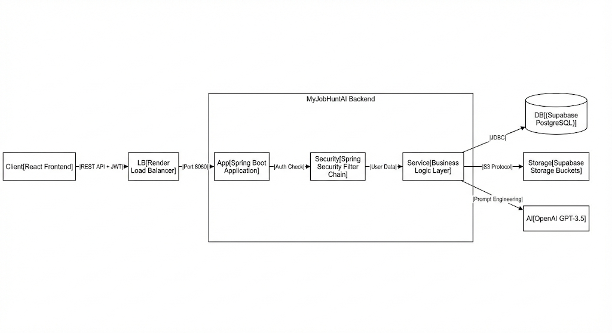

# 🚀 JobHuntAI - Intelligent Candidate Backend


### 📋 Overview
**JobHuntAI** is a cloud-native REST API designed to streamline the job application process. It leverages **Generative AI** to analyze candidate resumes and generate professional summaries, backed by a secure, role-based authentication system.

This project serves as a "Proof of Work" demonstrating modern Java backend architecture, including **stateless security**, **cloud storage integration**, and **LLM orchestration**.

---

### 🏗 Architecture
The application follows a layered architecture (Controller-Service-Repository) and utilizes the **S3 Protocol** for file handling.



### 🛠 Tech Stack

| Category | Technologies Used |
| :--- | :--- |
| **Core** | Java 21, Spring Boot 3.4 |
| **Security** | Spring Security 6, JWT (Stateless), BCrypt |
| **Database** | PostgreSQL (Supabase), Spring Data JDBC, HikariCP (Connection Pooling) |
| **Cloud & DevOps** | Docker, Render, AWS SDK (S3 Protocol for Supabase Storage) |
| **AI Integration** | Spring AI, OpenAI API |
| **Build Tool** | Maven |

---

### ✨ Key Features

#### 🔐 1. Advanced Security & Auth
* **Stateless Authentication:** Implemented custom `JwtAuthenticationFilter` to handle per-request authentication without server-side sessions.
* **Role-Based Access Control (RBAC):** Granular permissions for `ADMIN` and `CANDIDATE` roles using `@PreAuthorize`.
* **Security Best Practices:** Passwords hashed via BCrypt; CORS configured for frontend integration; standardized 401/403 JSON error handling.

#### ☁️ 2. Cloud Storage (S3)
* Integrated **Supabase Storage** using the `software.amazon.awssdk` library.
* Enables users to upload PDF resumes directly to cloud buckets with unique UUID generation to prevent file collisions.

#### 🤖 3. AI-Powered Resume Analysis
* Utilizes **Spring AI** to interface with LLMs.
* **Feature:** Automatically reads user profile data to generate a "Professional Summary" tailored for specific job applications.

#### ⚡ 4. Production-Grade Database
* **Connection Pooling:** Tuned **HikariCP** settings (`maximum-pool-size`, `max-lifetime`) specifically for cloud environments to handle latency and connection drops effectively.
* **Schema Management:** Automated schema initialization via `schema.sql`.

---

### 🚀 Getting Started

To run this application locally, you need **Java 21** and **Maven** installed.

#### 1. Clone the Repository
```bash
git clone [https://github.com/](https://github.com/)[YOUR-USERNAME]/myjobhuntai-backend.git
cd myjobhuntai-backend
```

#### 2. Environment Setup
Create a `.env` file in the root directory. **Do not commit this file.**

```properties
# Database (Supabase)
DB_URL=jdbc:postgresql://your-host.supabase.co:5432/postgres?sslmode=require
DB_USERNAME=postgres
DB_PASSWORD=your_db_password

# Authentication
JWT_SECRET=your_super_secret_key_minimum_32_chars

# Storage (Supabase S3)
SUPABASE_URL=[https://your-project.supabase.co/storage/v1/s3](https://your-project.supabase.co/storage/v1/s3)
SUPABASE_REGION=us-west-2
SUPABASE_ACCESS_KEY=your_access_key
SUPABASE_SECRET_KEY=your_secret_key

# AI
OPENAI_API_KEY=sk-proj-...
```

#### 3. Run the Application
```bash
# Using Maven Wrapper
./mvnw spring-boot:run
```

The API will be available at http://localhost:8080.
🐳 Docker Support
The application is fully containerized for deployment.
Bash# Build the image
docker build -t myjobhuntai-api .

# Run the container
docker run -p 8080:8080 --env-file .env myjobhuntai-api
📡 API Endpoints (Preview)


| Method | Endpoint | Description | Role |
| :--- | :--- | :--- | :--- | 
| POST | /api/auth/register | Register a new user and recieve JWT | PUBLIC |
| POST | /api/auth/login | Login and recieve JWT | PUBLIC |
| POST | /api/ai/generateGenerate | GENERATE RESUME SUMMARY | CANDIDATE |
| POST | /api/resumes/upload | Upload PDF Resume | CANDIDATE |

👤 Author
Nifemi - Backend Developer ( **Spring Boot** / **Asp.Net** / **Node.js**).<br/>
[My Linkedin](https://linkedin.com/in/nifemiakeju) | [My Email](akejunifemi11@gmail.com). 
This project is for demonstration and portfolio purposes.
